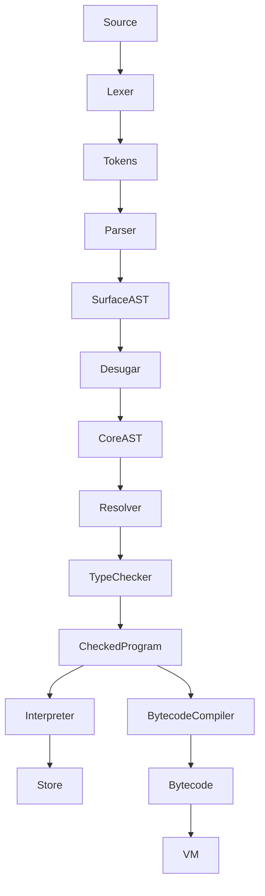

# NITLang architecture (design draft)

Status: only Milestone 0 is implemented. The modules below are planned contracts.
GROUP_SIZE = 1. Pattern matching is the single planned extension.

| Directory | Responsibility |
| --- | --- |
| src/cli | Argument validation, file access, diagnostics, exit status |
| src/diagnostics | Structured category/message/span/notes and rendering |
| src/frontend | Source positions, tokens, lexer, recursive descent and Pratt parser |
| src/ast/surface | User syntax, including for, and, or |
| src/ast/core | Independent evaluator syntax, including conditional expressions |
| src/desugar | Pure lowering, generated identifiers, source-span preservation |
| src/semantic/symbols | Static scoped symbols and binding identities |
| src/semantic/types | Explicit tagged types and centralized assignability |
| src/semantic | Resolution, return analysis, type checking |
| src/runtime | Locations, store, environments, values, completions |
| src/interpreter | Core AST execution only |
| src/stdlib | Typed builtin callable definitions for print and map |
| src/bytecode | Typed instructions, chunks, compiler, disassembler |
| src/vm | Operand stack, instruction pointer, scope stack |

AST nodes use discriminated unions and source spans. Surface and Core have
separate program/node types; lowering cannot leave surface-only nodes behind.
Semantic metadata lives in side tables keyed by node/binding identity. Parsing
and checking never evaluate a program. Only a successfully checked program
enters either execution backend. Bytecode compilation rejects unsupported nodes
before running any instructions.

Runtime environments map resolved bindings to Locations, and a Store maps each
Location to a tagged RuntimeValue. Static symbol tables are separate from runtime
environments. Closures retain lexical environments and share captured locations.
Object fields also own store locations; references contain existing locations.
Method dispatch walks the actual object's class chain.

Statement execution produces Normal, Return(value), or Throw(value). Expression
evaluation can propagate Throw. Controlled runtime faults carry diagnostics and
are distinct from catchable language throws. Host bugs are not disguised as
expected language errors.

VM instructions contain data, never host functions. Scope instructions preserve
shadowing. Both engines share primitive operation semantics and value formatting,
but execute independently. Differential tests compare their observable output.

Tests progress from phase units to real source pipelines and cross-backend tests.
No placeholder implementation is considered a passing language feature.
